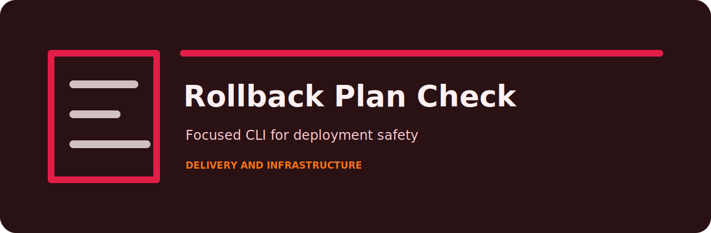
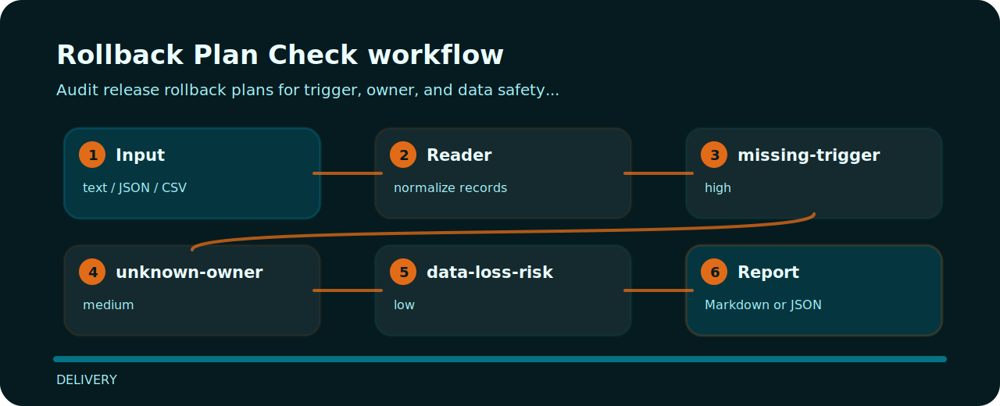

# Rollback Plan Check



Audit release rollback plans for trigger, owner, and data safety details.

## Before the fix

```text
risky: rollback trigger missing owner unknown data_loss possible
clean: rollback trigger p95_error owner platform data_loss none
```

## Checks in plain language

| Signal | Level | What it flags | Fix direction |
| --- | --- | --- | --- |
| `missing-trigger` | high | rollback trigger is missing | define measurable rollback trigger |
| `unknown-owner` | medium | rollback owner is missing | name rollback decision owner |
| `data-loss-risk` | low | data loss risk is unclear | document data safety constraints |

## Policy flow



## Fresh clone path

```bash
git clone https://github.com/mertefekurt/rollback-plan-check.git
cd rollback-plan-check
python -m pip install -e ".[dev]"
rollback-plan-check examples/sample.txt
```
